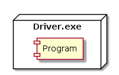

 

**CMPS 253 Software Engineering - Spring 2019-2020 \
American University of Beirut \
Mahmoud Bdeir**


## Lesson 2: Log Method (Abstraction Through Methods)


A better solution would be to use a method to do the logging, this way you guarantee uniform log output (for example: time followed by message) and we achieve Reusability.
> Software Reusability is an attribute that refers to the expected reuse potential of a software component. Software reuse not only improves productivity but also has a positive impact on the quality and maintainability of software products.

```C#
using System;
using System.Threading;
namespace Logger.Lesson2
{
    class Program
    {
        static void Main(string[] args) //send email to all students
        {
            Log("Program Started");
            Thread.Sleep(3000); //Simulating work by having the program sleep for 3 seconds
            Log("Program Ended");
        }
        static void Log(string msg)
        {
            Console.WriteLine($"{DateTime.Now} {msg}");
        }
    }
}
```

###### Class Diagram

###### Deployment Diagram


____
 You can use this method in the `Program` class only. How do you share it with other classes? Making the method public allows other classes to call on this method. However, doing so would defeat SRP:
> Single Responsibility Principle or SRP: A class should have one, and only one, reason to change.

<table style='width=100%;'>
<tr>
<td><a href="../../../../tree/master/Lesson%2001%20Inline%20Logging/Source%20Code"> Back</a></td>
<td width="100%"></td>
<td><a href="../../../../tree/master/Lesson%2003%20Logger%20Class/Source%20Code"> Next</a></td>
</tr>
</table>
