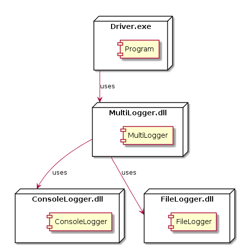

 

**CMPS 253 Software Engineering - Spring 2019-2020 \
American University of Beirut \
Mahmoud Bdeir**


## Lesson 7.0: Selective Log Targets (Abstraction Through Classes, SRP, SoC)

#### User Story 3: Selective Log Targets 
*US3*: As a user of a software that uses Logger, I would like to output to multiple targets *(File, Console, etc.)* when I run the program.

Logging is configured by the end-user of a software application that employs logging. This configuration entails, among other things, which target(s) to output to. Because this happens at runtime, user-input may be provided to the program when it is started in the form of command-line arguments. The question then becomes, which class/component gets those arguments. 

##### Solution 0: MultiLogger Configuration through command-line argument
One way is to let the `Main` method that gets these arguments decide where to log. But it should be immediately clear that it would not be the right thing to do (mixing program logic with logging logic, i.e. no SRP), we have an `MultiLogger` class that takes care of logging so why not make it determine the target(s).

Now that we decided to let `AllLoger` take care of determining the output targets by passing it a string retrieved from a command-line argument, the question becomes do we pass it to the `Log` method of MultiLogger? We can, but this will require the user (programmer) to pass the command-line argument in **each** call to `Log`. That is certainly an inconvenience, but also, is unnecessary because it is not how logging works, i.e. users of loggers do not need to determine in each log call which output to target.

A better approach is to pass the command-line argument, one-time only. To achieve this, we will force the instantiation of `MultiLogger` class to use it. This means the `Log` method will no longer be *static*, and we will provide an overloaded constructor were a string parameter will be passed representing the user's input for selecting output targets.


```C#
namespace Lesson7.Solution0
{
    [Flags]
    public enum LogDestination
    {
        None=0,
        Console=1,
        File=2,
        Both=4,
    }
}
```

```C#
namespace Lesson7.Solution0
{
    public class MultiLogger
    {
        private LogDestination logDestination = LogDestination.None;

        public MultiLogger(string cliArgument)
        {
            if (cliArgument == null)
                return;

            string targets = cliArgument.Split('=')[1].ToUpper();
            if (targets.Contains('C'))
            {
                logDestination |= LogDestination.Console;
            }
            if (targets.Contains('F'))
            {
                logDestination |= LogDestination.File;
            }
        }
        public void Log(string fileName, string msg)
        {
            if ((logDestination & LogDestination.Console) == LogDestination.Console)
            {
                ConsoleLogger.Log(msg);
            }
            if ((logDestination & LogDestination.File) == LogDestination.File)
            {
                FileLogger.Log(fileName, msg);
            }
        }
    }
}
```

```C#
using System.Linq;
using System.Threading;

namespace Lesson7.Solution0
{
    class Program
    {
        static void Main(string[] args)
        {
            //usage: driver.exe --target=cf

            string argument = args.SingleOrDefault(p=>p.ToLower().StartsWith("--target="));
            MultiLogger logger = new MultiLogger(argument);

            //Ready to start logging
            logger.Log(".\\log.txt", "Program Started");

            Thread.Sleep(3000); //Simulating work by having the program sleep for 3 seconds

            logger.Log(".\\log.txt", "Program Ended");
        }
    }
}
```

Now we can run the program with a command-line argument instructing it to log to specific target(s):
```
driver.exe --target=cf
```
_____

###### Class Diagram

###### Deployment Diagram


____

<table style='width=100%;'>
<tr>
<td><a href="../../../Lesson%2006%20Multiple%20Output%20Log/Solution%201%20MultiLogger%20Class%20and%20Library/Source%20Code"> Back</a></td>
<td width="100%"></td>
<td><a href="../../Solution%201%20Configuration%20File/Source%20Code"> Next</a></td>
</tr>
</table>
