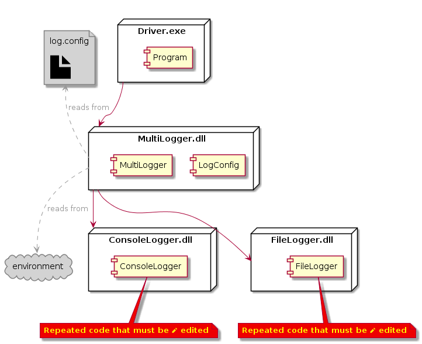

 

**CMPS 253 Software Engineering - Spring 2019-2020 \
American University of Beirut \
Mahmoud Bdeir**


## Lesson 8: Customizable Log Output Formatting (<font size=7>D</font>on't <font size=7>R</font>epeat <font size=7>Y</font>ourself)
<a href="./"> Source Code</a>

#### User Story 4: Customizable Log Output Formatting
*US4*: As a programmer, I would like to customize the format of the log output.

So far, we have made it so easy for the programmer to use our logging framework:
```C#
MultiLogger logger = new MultiLogger(LogConfig.CreateFromEnvironment());
logger.Log("Hello, world!"); 
```
However, nowhere did we provide the programmer with the ability to change the formatting of the output, for example, she might want to change the output from: `3/22/2020 6:01:07 PM Hello, world!` to `Sun, Mar 22,2020 18:01:07 Hello, world!`

Thinking about how we *(the authors of the logger framework)* would implement US4 we encounter a subtle but important design flaw in what we did so far: we have to make the change in two places: `ConsoleLogger.Log()` and `FileLogger.Log()`. If we add more loggers, we would have to make the change there too.


###### Changing output format requires making a change in two locations



In essence, we would have to edit/duplicate the following code in all loggers:
```C#
$"{DateTime.Now} {msg}\n"
```

 The problem with this is the same problem we wanted to avoid in lessons *1* and *5.0*: you could forget to make the change in all loggers, or make a mistake in the formatting in one of them. More formally, duplicating code is against a design principle called DRY or <b>D</b>on't <b>R</b>epeat <b>Y</b>ourself.

> DRY or Don't Repeat Yourself: Every piece of knowledge must have a single, unambiguous, authoritative representation within a system *[Hunt, Andrew; Thomas, David (1999). The Pragmatic Programmer : From Journeyman to Master]*. This applies to constants, functionality, and any other information in your code.  Duplication can happen as a result of impatient copy‐pasting, collaborators, or different sections of code that evolve to become more similar than they were at first.  The goal is that making one change will require changing just one place in your code.

The solution is, naturally, to have the output formatting code in 'one place' and somehow 'share it' with all the loggers. This could be achieved in at least three ways:

1. Through a separate utility method shared between all loggers
1. Through the `LogConfig` class
1. Through a common base class


____

<table style='width=100%;'>
<tr>
<td><a href="../../Lesson%2007%20Dynamic%20Log%20Output/Solution%202%20Environment%20Variables/Source%20Code"> Back</a></td>
<td width="100%"></td>
<td><a href="../../tree/master/Lesson%2003%20Logger%20Class"> Next</a></td>
</tr>
</table>
